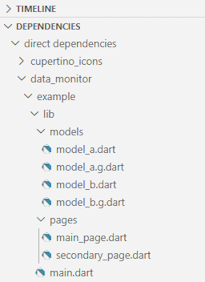

## Example

You can create an example Flutter application that uses `data_monitor` by:

1. At the command line, run `flutter create your_app_name` to create a
   Simple Counter App.

2. Open the application in your favorite editor and delete `lib/main.dart`.

3. Add the following dependencies to your project's `pubspec.yaml` file:

```
  dependencies:
    data_monitor: ^2.0.0
  
  dev_dependencies:
    build_runner: ^2.15.0
    data_monitor_generators: ^2.0.0
```

4. Perform a `pub get` to get the packages listed above.

5. In your editor, find the imported `data_monitor` package and it's
   example/lib/ hierarchy. If you are using Visual Studio Code, for
   example, it is at the bottom left and looks like this:

    

6. Copy the whole /lib hierarchy to your local project (2 directories,
   7 files).

7. Then, in a console, run the following command before you build / run
   your application:

```
  dart run build_runner build
```
